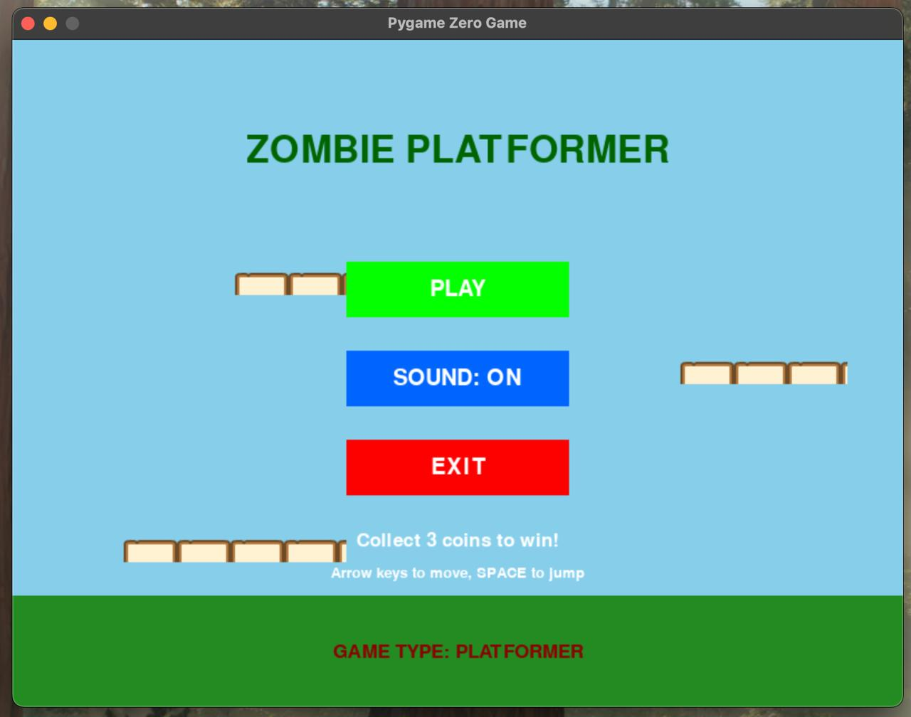
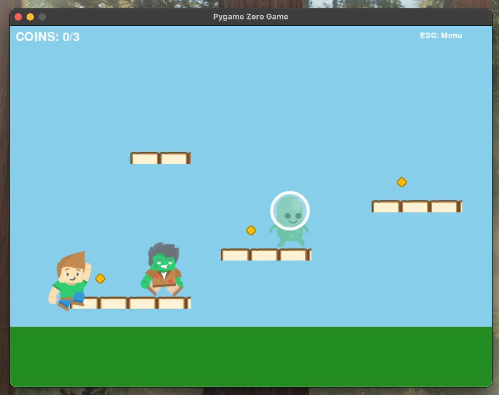
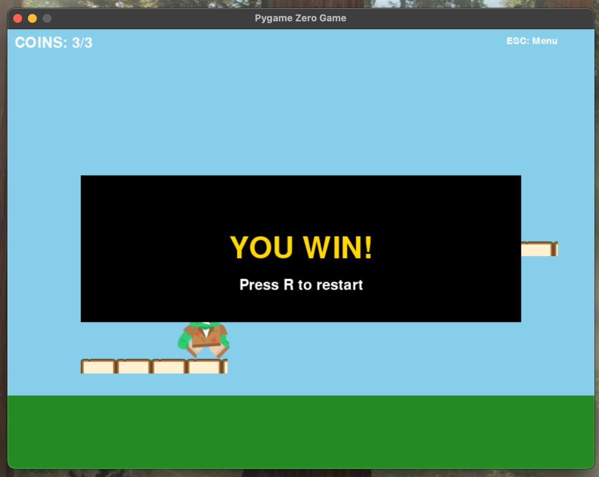
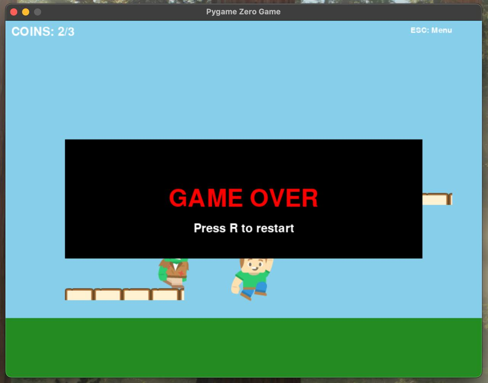

# Zombie Platformer Game

## Project Overview
A fun, educational 2D platformer game built with PyGame Zero. Collect coins while avoiding zombies and aliens to win! 
This project demonstrates clean Python code, object-oriented design, and game development fundamentals suitable for all ages (8-17).

### Prerequisites
- Python 3.11 (Required for PyGame Zero compatibility)

## Installation Guide

### Step 1: Clone/Download Project
```bash
# Clone repository or extract downloaded ZIP
git clone https://github.com/Pats101/platformer-game-kodland.git
cd zombie-platformer

### Step 2: Create and Activate Environment to Run Code
# Create virtual environment
python -m venv venv

# Activate virtual environment
# For Windows:
venv\Scripts\activate

# For macOS/Linux:
source venv/bin/activate

### Step 3: Install Pgzero
# Install required libraries
pip install pgzero

```

# Course Card – Python LVL1

| Infor on | Details |
|-------|---------|
| **Project Name** | Zombie Escape |
| **Game Type** | 2D Platformer (Pygame Zero) |
| **Student Age** | 8+ years |
| **Difficulty** | Beginner – Intermediate |

## Students learn how to:

- use variables to store positions, speed, and game state
- use **if**, **elif**, and **else** to control game logic
- use **while** / game loop logic for continuous gameplay
- work with **lists** to manage enemies
- detect collisions with colliderect
- create simple animations using sprite sequences
- organize code with **functions** and **classes**
- add sounds and background music
- understand win and lose conditions in games

## Students will be able to:

- perform logical thinking
- problem-solve
- debug code
- understand basic game design
- read and explain code

## Final result:

The student creates a complete playable game with a menu, enemies, animations, sound effects, and a clear ending condition. Please view the menu, start, win and lose images of the game.


<p>
  
</p>

<p>
  
</p>

<p>
  
</p>

<p>
  
</p>
